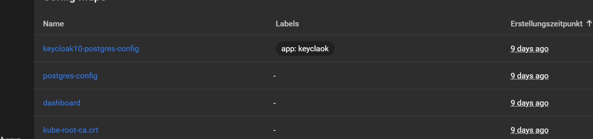
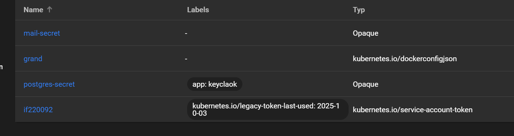
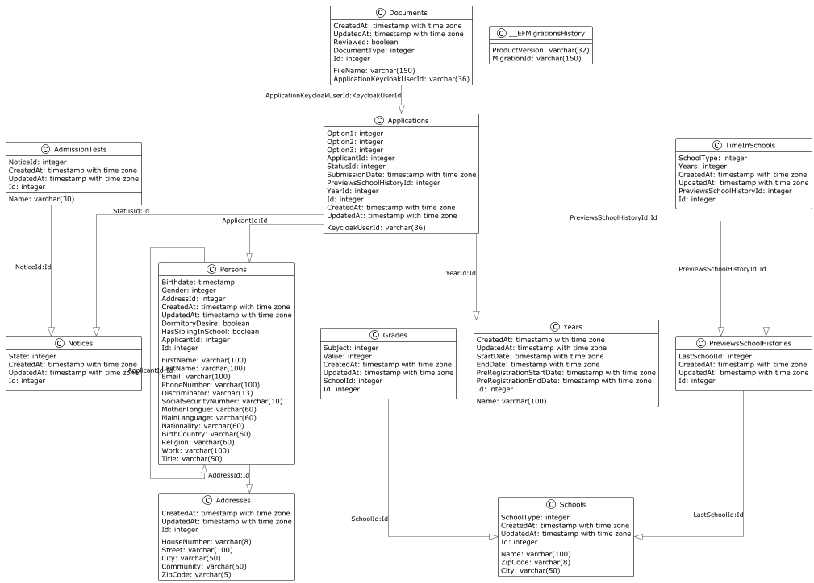

# Projektübersicht

## Technologien
- **Frontend:** Angular mit TypeScript
- **Backend:** C# mit EF Core
- **Datenbank:** PostgreSQL
- **Authentifizierung:** Keycloak

---  

## Funktionen
- **Sek.:** Die eingegebenen Daten werden auf Richtigkeit und Vollständigkeit geprüft.
- **AV:** Die Schüler werden anhand definierter Kriterien den passenden Klassen zugeteilt und anschließend übersichtlich organisiert.

---  

## Dateien
- Dateien werden nicht in der Datenbank, sondern in einem Ordner gespeichert.
- Speicherung erfolgt über die **Keycloak-ID**.
- Dateien werden nur mit Path in der Datenbank gespeichert.

**Geplante Funktionen:**
- Bewerbungen abrufen
- (neuen **RoleController** erstellen)

---  

## Leocloud
- **Ingress (Keycloak, Secretary, AV, Frontend, Backend):** Kontrolle von Ein- und Ausgängen, Redirects
- **Claim (Keycloak, DB, Backend):** Fester Speicherplatz, um Datenverlust zu vermeiden
- **BackUp (Keycloak, DB, Backend):** Datensicherheit und Grundstrukturbeibehaltung
- **Config Maps:** Übersicht aller Konfigurationen
    - keycloak10-postgres-config: Konfiguration zu Keycloak
    - postgres-config: Konfiguration der DB
    
    
    
    **Secret:** 
    - mail-secret: Zugangsdaten für Email
    - grand: Zugangsdaten für Github
    - postgres-secret: Zugangsdaten für Keycloak

---  

## Keycloak
- **Login:** Anmelden
- **Realm:** Abgeschotteter Bereich; kann selected werden
- **Client:** Schnittstelle für eine Application
- **Client erstellen:** Daten setzen wie folgt
- **Root URL:** [Domain]/fronted; Anfang
- **Home URL:** default
- **Rollenvergabe:** Rollen wie admin, secretary und applicant werden im Client festgelegt.
- **Benutzer und Rechte:** Benutzer werden im Realm angelegt und mit Rollen versehen.
- **Zentrale Verwaltung:** Keycloak verwaltet alle Clients und Benutzer über die Admin-Konsole.

 
---
- **Ingress:** Kontrolle von Ein- und Ausgängen
- **Claim (Keycloak, Backend):** Fester Speicherplatz, um Datenverlust zu vermeiden

## Backend
- **API**
    - ASP.NET Core (MVC)
    - Controller mit API-Versionierung
    - Swagger API mit Keycloak

- **App Settings**
    - Keycloak
    - API-Versionierung
    - Mail-Server
    - Allgemeine Konfigurationen

- **E-Mail**
    - HTML-basiert
    - Nutzung eines MailService anstelle direkter Implementierung

- **Models & Services**
    - Dateien werden mit AES verschlüsselt
    - Schlüssel in den App Settings gespeichert

- **Migrationen**
    - Durchführung bei Änderungen an den Models

- **DataContext**
    - Konfiguration der Datenbank
    - Create & Update & IDs automatisch generiert

- **Keycloak**
    - Berechtigungen abrufen
    - Benutzer anlegen
    - Rollen zuweisen
---

## Frontend
- **Angular:** Framework zur Erstellung von Webanwendungen
- **TypeScript:** Programmiersprache, die JavaScript erweitert
- **i18n:** Internationalisierung zur Unterstützung mehrerer Sprachen
- **Keycloakjs:** JavaScript-Adapter für die Integration von Keycloak
- **Primeng:** UI-Komponentenbibliothek für Angular
- **Environments:** Verwaltung von Umgebungsvariablen für verschiedene Deployments

### Aufbau
- **Components:** Wiederverwendbare UI-Elemente
  - Errordisplay
  - Field
  - Group
  - LegalGuardian
  - Navbar
- **Guards:** Schutz von Routen basierend auf Authentifizierungs- und Autorisierungsregeln
  - AuthGuard
  - StartingPageGuard
- **Interceptors:** Abfangen und Modifizieren von HTTP-Anfragen und -Antworten
    - BearerTokenInterceptor
- **Models:** Definition von Datenstrukturen
  - Application  
  - Converter
  - Field
  - FieldType
  - Group
  - LegalGuardian
  - Step
- **Pages:** Verschiedene Seiten der Anwendung
  - StartingPage
  - Stepwizard
  - ApplicationOverview
  - ApplicationReview
- **Services:** Geschäftslogik und Kommunikation mit dem Backend
  - ApiClient
  - ApplicationService
  - ErrorHandlingService
  - FileManagementService
  - ValidationService
- **Types:** Definition von benutzerdefinierten Typen und Schnittstellen
  - Nullable 
- **Assets:** Statische Ressourcen wie Bilder, Schriftarten und Stile
   - de.json 
   - en.json
   - logo
### Ablauf
1. **StartingPage:** Startseite mit Informationen und Login-Optionen
2. **ApplicationOverview:** Übersicht über den Bewerbungsprozess und den aktuellen Status
3. **Stepwizard:** Schritt-für-Schritt-Anleitung zur Eingabe der Bewerbungsdaten
4. **ApplicationReview:** Überprüfung und Bestätigung der eingegebenen Daten vor dem
5. **Absenden der Bewerbung**
---

## GitHub
- **Issues:** Erfassen neuer oder korrigierter logischer Funktionalitäten
- **Branches:** Für jede Issue eine eigene Branch erstellen
- **Commits:** Immer *amend commit* verwenden
- **Organisation:** Nutzung von Project Board und Backlog

---  

## Kommunikationsweg
- **Discord** Hauptkanal für die Teamkommunikation.

---  

## Struktur
